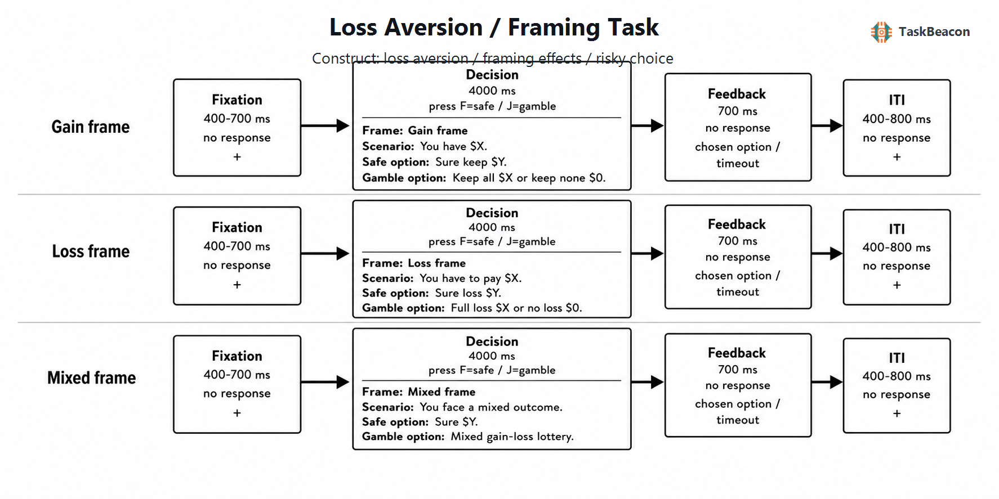

# 参考点、框架效应与损失厌恶：风险选择范式的理论基础及 TaskBeacon 实现

风险决策研究需要区分两个彼此相关但不可互换的问题：同一结果仅因收益或损失措辞而改变风险选择，反映描述不变性的破坏；在同时包含潜在收益与损失的赌局中，等额损失是否获得高于等额收益的主观权重，则涉及损失厌恶。前者通常以数学等值的收益框架与损失框架比较风险选择率，后者通常通过一系列混合赌局估计得失权重。两类操作都以参考点依赖为理论基础，但还分别受到风险态度、概率加权、选项措辞、注意分配和反应策略影响。将二者置于同一实验有助于比较表述敏感性与得失权衡，却不能据一个总风险选择率推断统一的“损失厌恶”特质。

## 1. 范式提出与理论背景

期望效用理论要求偏好在数学等值的描述间保持不变。前景理论（prospect theory）改以参考点为零点表征结果，并以收益域凹、损失域凸且损失侧较陡的价值函数解释确定收益偏好、确定损失回避及得失不对称；概率则经非线性决策权重转换（Kahneman & Tversky, 1979）。累积前景理论进一步以累积概率加权处理多结果赌局，并系统化了风险态度、概率加权和损失厌恶参数的分离（Tversky & Kahneman, 1992）。因此，观察到收益域风险规避、损失域风险寻求并不足以单独证明损失厌恶；只有在明确参考点并同时操控得失幅度后，损失相对收益的边际权重才可被识别。

风险选择框架效应源于“亚洲疾病问题”：结果数量和概率保持等值时，“挽救”表述增加确定选项选择，“死亡”表述增加风险选项选择（Tversky & Kahneman, 1981）。后续研究将社会情境改写为货币禀赋：先呈现初始金额，再把确定方案表述为保留一部分或损失一部分，并将同一风险方案表述为保留全部/一无所获或不损失/损失全部。这一改动提供了可重复试次与事件时序，适合行为及功能磁共振成像（functional magnetic resonance imaging, fMRI）研究（De Martino et al., 2006）。混合赌局则通常要求接受或拒绝一个具有相同得失概率、但得失金额逐试次变化的方案；Tom 等（2007）的参数化设计由接受概率随潜在收益和损失金额的变化估计行为损失厌恶，并将该参数与决策期 BOLD 信号联系起来。由此形成了两条互补的方法路线：等值框架对比测量描述诱发的偏好反转，参数化混合赌局测量参考点附近的得失权衡。

## 2. 任务逻辑、流程与核心测量

标准框架试次通常依次呈现禀赋或情境、确定选项与风险选项，并在限定时间内记录选择。关键操控在于跨框架保持最终结果与概率等值，名义上的“收益”或“损失”标签只改变描述。例如，获得 100 元后确定保留 80 元，与确定损失 20 元的最终财富相同；80% 保留 100 元、20% 保留 0 元，也与 80% 不损失、20% 损失 100 元相同。主要指标为损失框架风险选择率减去收益框架风险选择率，也可用试次级逻辑回归估计框架、期望值、概率与金额的效应。反应时能够补充决策冲突或加工投入的信息，但速度差异不具有单一构念含义。

混合赌局以当前财富或零结果为参考点，风险方案通常为概率 \(p\) 获得 \(G\)、概率 \(1-p\) 损失 \(L\)，确定方案通常为 0。若采用线性局部价值函数，可用收益系数与损失系数之比近似损失厌恶参数 \(\lambda\)；更完整的模型还需同时估计价值函数曲率、概率加权和选择噪声。仅呈现少量报价时，接受率主要反映这些因素的合成。可靠估计要求得失金额覆盖个体无差异点、试次数足够，并避免得失范围、刺激排序或确定方案系统性偏置参数。

结果反馈并非两类任务的必要组成。纯描述任务可在选择后直接进入下一试次，以测量对明确概率的静态评价；反馈型任务会实际抽取结果，随后选择还受到近期输赢、学习和追损影响。两种版本回答的问题不同。固定报价可用于群体水平框架比较；自适应阶梯或动态优化报价可围绕个体无差异区间提高参数信息量，但其停止规则与先验会影响估计。研究报告因而应分别说明框架对比、混合赌局模型、是否真实激励、是否兑现随机结果以及是否采用反应依赖的报价调整。

## 3. 主要行为与神经科学发现

### 3.1 群体效应及其设计依赖性

框架效应在群体水平具有较稳定的方向，但幅度受程序显著调节。早期元分析得到小至中等总体效应，并指出参考点改变、结果显著性、被试内或被试间设计及反应方式均会改变效应量（Kühberger, 1998）。系统综述结合多实验室和跨国资料后认为，经典风险选择框架效应约处于中等量级，同时强调“框架”涵盖的操作并不等质（Kühberger, 2023）。对 19 个国家、13 种语言共 4,098 名参与者的直接重复验证了原前景理论多数题目与理论对比，但国家间及个体内仍有明显异质性（Ruggeri et al., 2020）。因此，稳定的平均差异不意味着任一个体在所有题目上持续表现为框架敏感。

措辞本身构成重要替代解释。DeKay 和 Dou（2024）系统组合正负信息后发现，收益与损失条件中选项描述是否匹配可放大、消除或反转效应；在平衡描述后仍保留框架效应，但幅度下降。这说明“损失框架风险率高于收益框架风险率”同时包含参考点、语义效价和信息结构的作用。控制期望值而未控制句法长度、零结果强调或选项信息量，不能把差值全部归因于价值函数曲率。

损失厌恶的平均强度更具争议。Brown 等（2024）汇总 150 项研究的 607 个估计，得到平均 \(\lambda\) 约为 1.96；Walasek 等（2024）仅对可获得原始数据并能联合估计前景理论参数的研究重建模型，得到较小的平均值 1.31。Yechiam 和 Zeif（2025）进一步指出，在得失范围对称且刺激未按金额排序的研究子集中，重分析参数约为 1.07，未显著高于 1。美国代表性激励样本还显示，约半数参与者愿意接受含损失的负期望值赌局，样本构成对“普遍损失厌恶”的结论具有实质影响（Chapman et al., 2025）。这些结果并未否定参考点依赖，却表明损失厌恶不是由一次混合赌局拒绝或简单风险率即可稳定识别的常数。

### 3.2 fMRI 对决策期过程的约束

货币框架任务中，De Martino 等（2006）发现符合经典框架偏向的选择与杏仁核活动相关，眶额及内侧前额叶活动则与较低的个体框架敏感性相关。该结果支持情感显著性参与框架选择，但区域相关不能证明“情绪系统”单向导致非理性。较大样本的全脑网络分析显示，框架一致选择更接近默认或低任务投入相关活动，框架不一致选择更接近任务参与及认知控制网络；情绪图谱相似度并不能独立预测选择（Li et al., 2017）。两项研究共同支持框架选择受情感评价和加工投入调节，而不支持以杏仁核活动作为框架偏向的专属标志。

在混合赌局中，潜在收益增加伴随腹侧纹状体、内侧前额叶等价值相关区域活动上升，潜在损失增加则表现为这些信号下降；神经得失斜率与行为损失厌恶相关（Tom et al., 2007）。这一发现说明得失金额在分布式估值系统中以不对称斜率编码，但 BOLD 的方向与幅度不能区分价值、唤醒和注意。杏仁核双侧损伤个案表现出货币损失厌恶消失，为杏仁核参与提供了较强因果线索，但极小且特殊的病灶样本限制了向一般人群推广（De Martino et al., 2010）。采用“像交易者一样”聚合评价多次选择可降低行为损失厌恶，提示参考点与情绪调节策略具有可塑性（Sokol-Hessner et al., 2009）。

### 3.3 EEG 所揭示的反馈时程

事件相关电位（event-related potential, ERP）适合区分反馈后的早期效价编码与较晚资源分配。Jin 等（2025）在货币赌博和混合彩票任务中重复测量行为与脑电，发现损失或较低结果诱发更大的反馈相关负波（feedback-related negativity, FRN），P300 同时对结果效价和幅度敏感；混合彩票风险选择率的重测组内相关系数为 0.664，FRN 与 P300 的得失条件指标多为中等信度。该证据针对真实结果评价阶段，不等同于决策期损失权重。没有呈现实际输赢的任务无法由选择确认反馈产生同一 FRN/P300 对比，头皮 ERP 的空间来源也不宜直接等同于特定皮层结构。

## 4. 范式发展与主要应用

该范式的发展重点是由一次性偏好反转转向试次级建模和个体差异估计。参数化报价把收益幅度、损失幅度、概率与确定选项分开，为研究情绪调节、病灶损害和神经估值提供了共同尺度（Tom et al., 2007; Sokol-Hessner et al., 2009）。跨任务比较同时揭示，问卷、单次彩票、学习任务与混合赌局得到的风险偏好相关性有限，同一“风险态度”标签下的测量未必共享心理结构（Pedroni et al., 2017）。由此，临床或发展研究若观察到组间风险率不同，仍需检验差异来自参考点、概率理解、认知能力、近期反馈还是一般反应偏向，不能把群体差值直接解释为诊断性损失厌恶。

大样本与代表性样本改变了对外部效度的判断。跨文化重复表明前景理论的若干定性模式可跨语言出现，但效应幅度随国家和题目变化（Ruggeri et al., 2020）；代表性激励调查则发现学生样本明显高估一般人群中损失厌恶者的比例（Chapman et al., 2025）。范式适用于比较情绪调节、决策能力和人群差异，前提是保留具体报价与选择模型，并把样本构成视为理论边界，而非仅作为控制变量。

## 5. 测量效度与解释边界

构念效度首先依赖操作分离。收益/损失框架差值测量描述敏感性；混合赌局中的得失系数比才对应模型化损失厌恶。风险方案与确定方案期望值不等、概率不对称或得失范围不平衡时，风险态度和概率加权会进入同一选择。注意捕获也是可竞争解释：损失可增加注意和一致性，而不必提高损失的主观价值（Yechiam & Hochman, 2013）。研究设计应随机化报价顺序，平衡左右位置及信息量，检查概率理解，并在模型比较中纳入常数拒绝偏向与选择噪声。

可靠性需要区分群体平均效应与个体排序。大量试次可以稳定估计平均框架差异，但差值分数常因两条件高度相关而降低个体信度；跨任务风险测量相关有限也表明个体参数依赖具体操作（Pedroni et al., 2017）。近期混合彩票研究获得中等行为重测信度，但包含选择后实际结果，不能直接外推到无结果反馈的描述任务（Jin et al., 2025）。真实激励、随机兑现、训练、时间压力和反馈历史都会改变外部效度。对单个参与者进行特质或临床判断，应报告参数不确定性与重测资料，而不能依据少量试次的风险选择率分类。

## 6. TaskBeacon 中的任务实现

### 6.1 任务资源与访问入口

| 资源 | ID | 用途 | 地址 |
|---|---|---|---|
| TaskBeacon 完整行为实验源码 | T000031 | 本地 PsychoPy/PsyFlow 行为采集实现 | [GitHub](https://github.com/TaskBeacon/T000031-loss-aversion-framing) |
| TaskBeacon 浏览器预览源码 | H000031 | 与本地版语义对齐的行为型网页预览 | [GitHub](https://github.com/TaskBeacon/H000031-loss-aversion-framing) |
| 在线体验入口 | H000031 | 浏览器任务体验与行为数据导出 | [运行任务](https://taskbeacon.github.io/psyflow-web/?task=H000031-loss-aversion-framing) |

H000031 的公开元数据将其标记为已通过冒烟测试的行为型网页版本；它复用区组日程、报价题库和反馈语义，但浏览器时序仍需在目标设备上验证，不能视为本地受控采集的等价替代。

### 6.2 实现流程与关键参数

TaskBeacon 当前版本采用 3 个区组、每区组 32 个试次，共 96 个试次；收益框架、损失框架与混合框架按条件日程呈现。每个条件从四个固定报价中按种子确定性抽样，不随既往选择或反应时自适应。部分收益与损失报价具有对应的最终财富和期望值，例如保留 80/100 元对应损失 20/100 元；120 元报价的跨框架参数并不等值，独立抽样也不保证配对报价在个体内等频出现。混合报价包含 0 或 10 元确定方案以及不同得失幅度，其中部分风险方案的期望值高于确定方案。因此，框架差值宜用于描述敏感性，混合条件的风险选择率不宜直接换算为 \(\lambda\)。

**图 1. TaskBeacon 当前实现的试次流程与条件映射。** 每一试次先呈现 400–700 ms 注视点，随后在 4,000 ms 决策窗内同时呈现框架标签、情境、左侧确定方案与右侧风险方案；F 键选择确定方案，J 键选择风险方案。收益框架先给定 100–150 元预算，确定方案为保留部分金额，风险方案为以 60%–80% 概率保留全部、否则保留 0；损失框架使用同一预算范围，确定方案为损失部分金额，风险方案为以 20%–40% 概率损失全部、否则无损失；混合框架在 40% 或 50% 收益概率下同时给出潜在收益与损失。随后 700 ms 反馈仅确认所选方案或超时，任务内不抽取、累计或显示实际金钱结果；试次间隔为 400–800 ms 注视。报价由固定题库和随机种子抽取，无反应依赖的难度或无差异点调整，当前实现也未设置基于实际输赢的计分规则。

主要记录包括条件、报价编号、确定与风险方案期望值、选择键、确定/风险选择、反应时和超时状态。区组间及任务结束界面报告风险选择率、平均反应时与超时数，结束界面另列三条件风险率。该实现适合估计群体水平框架差异并探索报价层面的风险选择；由于每个混合条件仅有四类报价、未围绕个体无差异点自适应且任务内没有结果抽取，它更接近简化的描述型行为任务，不足以独立提供精确的个体损失厌恶参数或结果反馈 ERP 指标。现有仓库文件无法确认屏幕金额是否与实验报酬兑换。

## 参考文献

Brown, A. L., Imai, T., Vieider, F. M., & Camerer, C. F. (2024). Meta-analysis of empirical estimates of loss aversion. *Journal of Economic Literature, 62*(2), 485–516. https://doi.org/10.1257/jel.20221698

Chapman, J., Snowberg, E., Wang, S. W., & Camerer, C. (2025). Looming large or seeming small? Attitudes towards losses in a representative sample. *The Review of Economic Studies, 92*(5), 2893–2922. https://doi.org/10.1093/restud/rdae093

De Martino, B., Camerer, C. F., & Adolphs, R. (2010). Amygdala damage eliminates monetary loss aversion. *Proceedings of the National Academy of Sciences, 107*(8), 3788–3792. https://doi.org/10.1073/pnas.0910230107

De Martino, B., Kumaran, D., Seymour, B., & Dolan, R. J. (2006). Frames, biases, and rational decision-making in the human brain. *Science, 313*(5787), 684–687. https://doi.org/10.1126/science.1128356

DeKay, M. L., & Dou, S. (2024). Risky-choice framing effects result partly from mismatched option descriptions in gains and losses. *Psychological Science, 35*(8), 918–932. https://doi.org/10.1177/09567976241249183

Jin, J., Xiao, Q., Liu, Y., Xu, T., & Shen, Q. (2025). Test–retest reliability of decisions under risk with outcome evaluation: Evidence from behavioral and event-related potentials (ERPs) measures in 2 monetary gambling tasks. *Cerebral Cortex, 35*(3), bhaf058. https://doi.org/10.1093/cercor/bhaf058

Kahneman, D., & Tversky, A. (1979). Prospect theory: An analysis of decision under risk. *Econometrica, 47*(2), 263–291. https://doi.org/10.2307/1914185

Kühberger, A. (1998). The influence of framing on risky decisions: A meta-analysis. *Organizational Behavior and Human Decision Processes, 75*(1), 23–55. https://doi.org/10.1006/obhd.1998.2781

Kühberger, A. (2023). A systematic review of risky-choice framing effects. *EXCLI Journal, 22*, 1012–1031. https://doi.org/10.17179/excli2023-6169

Li, R., Smith, D. V., Clithero, J. A., Venkatraman, V., Carter, R. M., & Huettel, S. A. (2017). Reason's enemy is not emotion: Engagement of cognitive control networks explains biases in gain/loss framing. *The Journal of Neuroscience, 37*(13), 3588–3598. https://doi.org/10.1523/JNEUROSCI.3486-16.2017

Pedroni, A., Frey, R., Bruhin, A., Dutilh, G., Hertwig, R., & Rieskamp, J. (2017). The risk elicitation puzzle. *Nature Human Behaviour, 1*(11), 803–809. https://doi.org/10.1038/s41562-017-0219-x

Ruggeri, K., Alí, S., Berge, M. L., Bertoldo, G., Bjørndal, L. D., Cortijos-Bernabeu, A., Davison, C., Demić, E., Esteban-Serna, C., Friedemann, M., Gibson, S. P., Jarke, H., Karakasheva, R., Khorrami, P. R., Kveder, J., Lind Andersen, T., Lofthus, I. S., McGill, L., Nieto, A. E., . . . Folke, T. (2020). Replicating patterns of prospect theory for decision under risk. *Nature Human Behaviour, 4*(6), 622–633. https://doi.org/10.1038/s41562-020-0886-x

Sokol-Hessner, P., Hsu, M., Curley, N. G., Delgado, M. R., Camerer, C. F., & Phelps, E. A. (2009). Thinking like a trader selectively reduces individuals' loss aversion. *Proceedings of the National Academy of Sciences, 106*(13), 5035–5040. https://doi.org/10.1073/pnas.0806761106

Tom, S. M., Fox, C. R., Trepel, C., & Poldrack, R. A. (2007). The neural basis of loss aversion in decision-making under risk. *Science, 315*(5811), 515–518. https://doi.org/10.1126/science.1134239

Tversky, A., & Kahneman, D. (1981). The framing of decisions and the psychology of choice. *Science, 211*(4481), 453–458. https://doi.org/10.1126/science.7455683

Tversky, A., & Kahneman, D. (1992). Advances in prospect theory: Cumulative representation of uncertainty. *Journal of Risk and Uncertainty, 5*(4), 297–323. https://doi.org/10.1007/BF00122574

Walasek, L., Mullett, T. L., & Stewart, N. (2024). A meta-analysis of loss aversion in risky contexts. *Journal of Economic Psychology, 103*, 102740. https://doi.org/10.1016/j.joep.2024.102740

Yechiam, E., & Hochman, G. (2013). Losses as modulators of attention: Review and analysis of the unique effects of losses over gains. *Psychological Bulletin, 139*(2), 497–518. https://doi.org/10.1037/a0029383

Yechiam, E., & Zeif, D. (2025). Loss aversion is not robust: A re-meta-analysis. *Journal of Economic Psychology, 107*, 102801. https://doi.org/10.1016/j.joep.2025.102801
